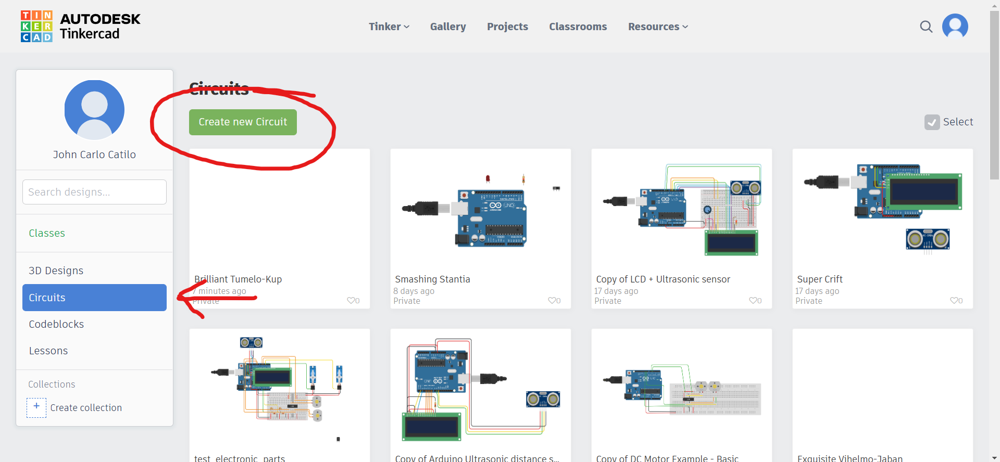
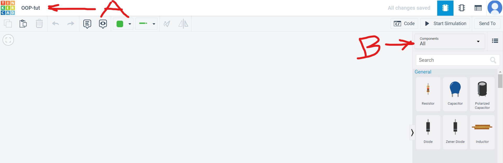
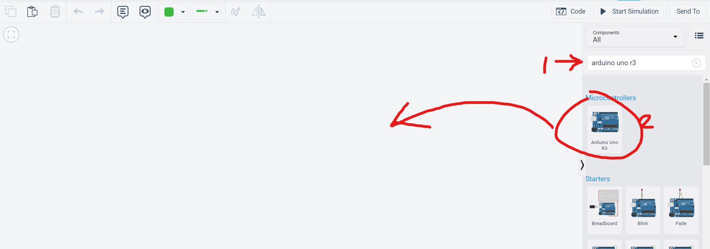
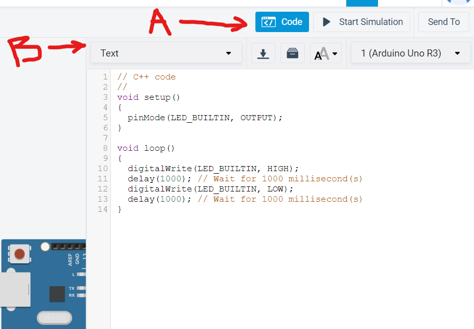
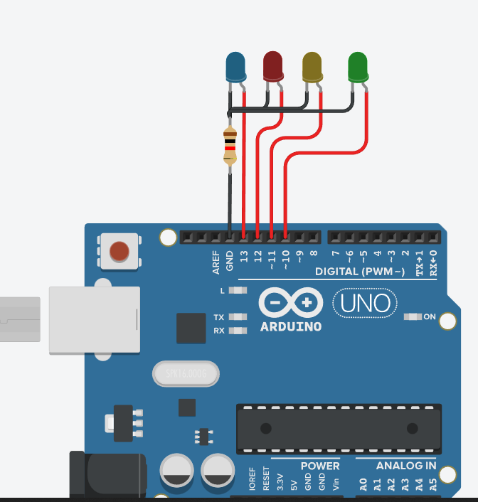

> Making your arduino code via OOP is a step up to regular line by line, function-based coding. 
The main advantage of using OOP in arduino is when you have lots of sensor and motors and displays, which have common modes in declaration, instantiation, and just a few parameters change like pin number and what not. This has a deeper advantage which is that OOP makes your code flexible when adding more of something without repeatitive code. 
a
In this lesson we will particularly use tinkerCAD so everyone can test the final code. And also we can appreciate virtual sensors and actuators that move on screen. 
See [this](https://www.tinkercad.com/things/jr3d2wtCgg3-brilliant-tumelo-kup/) link for a quick glance of the final output for this tutorial.

1. Go to tinkercad.com[](https://tinkercad.com) and create an acccount.
2. After creation, select "Circuits" and then "Create new Circuit". Refer to image below.
</img>

3. Give you project a unique name (See A below). Click the dropdown menu in "B" and select "All" to give us all possible components in tinkercad.


4. In the component search bar, type **Arduino uno r3** and drag the selected component in your canvass.


5. To start coding that arduino click on the arduino. Press **Code**(refer to A below). Then select **text** in the dropdown menu (refer to B below).


6. Repeat component addition until you reach this image on your canvass.



- typical declaration will be:

```
int led_green = 10;
int led_yellow = 11;
int led_red = 12;
int led_blue = 13;

void setup()
{
  pinMode(led_green, OUTPUT);
  pinMode(led_yellow, OUTPUT);
  pinMode(led_red, OUTPUT);
  pinMode(led_blue, OUTPUT);
}

void loop()
{
  digitalWrite(led_green, HIGH);
  delay(500);
  digitalWrite(led_green, LOW);
  delay(500);  
  digitalWrite(led_yellow, HIGH);
  delay(500);
  digitalWrite(led_yellow, LOW);
  delay(500);  
  digitalWrite(led_red, HIGH);
  delay(500);
  digitalWrite(led_red, LOW);
  delay(500);  
  digitalWrite(led_blue, HIGH);
  delay(500);
  digitalWrite(led_blue, LOW);
  delay(500);  
}
```
> Try pasting the code in your tinkercad coding pane, and press **Start Simulation**. The above code is fine for blinking 4 LEDs but, what if you have 50 LEDs? It would be very tedious. A more scalable solution is OOP by creating **objects** via public **classes**.

- OOP Code would be...

```

class LED { // this will be the parent object name you created
    int pin; //this can be any variable name
  public:
    LED(int led_pin) {
      pin = led_pin;
      pinMode(pin, OUTPUT);// this line replaces the pinMode in setup() in the previous code
    }
  void Blink(){ // this is a subclass which can be used by the objects under this parent object you will create
  	digitalWrite(pin, HIGH);
    delay(500);
    digitalWrite(pin, LOW);
    delay(500);
  }
};

//Creating objects
// format: <Parent object name> <child object>(parameter/pin_number);
LED led_green(10);
LED led_yellow(11);
LED led_red(12);
LED led_blue(13);

void setup()
{
  //the instantiation and set up of pins are now done above.
}

void loop()
{
// format: <child>.<subclass>(parameter)
led_green.Blink(); //no parameter was passed in our curent case but we can utilize this in other projects
led_yellow.Blink();
led_red.Blink();
led_blue.Blink();
}
```

>Try the code above and it should do the same thing as the previous code; blinking 4 leds. There might be some work in setting up the objects but it is noticeable that the code in creating new objects and commands you want to execute in the loop are more **reproducable**, **maintainable**, and **readable/understandable**.

This will do for now. 
In the next tutorial, we will utilize a sensor called HC-SR04. There, we will really see the advantage of learning OOP since the sensor needs two data pins(one output mode, one input mode) and requires some calculation function to determine the distance of a certain object to it. See you!