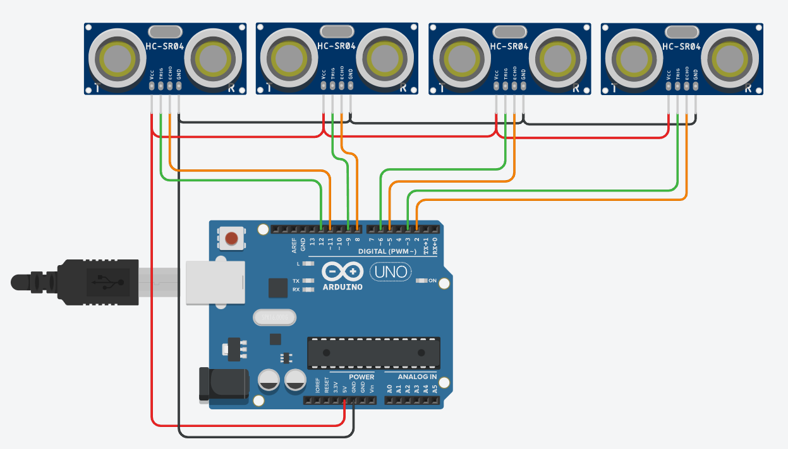
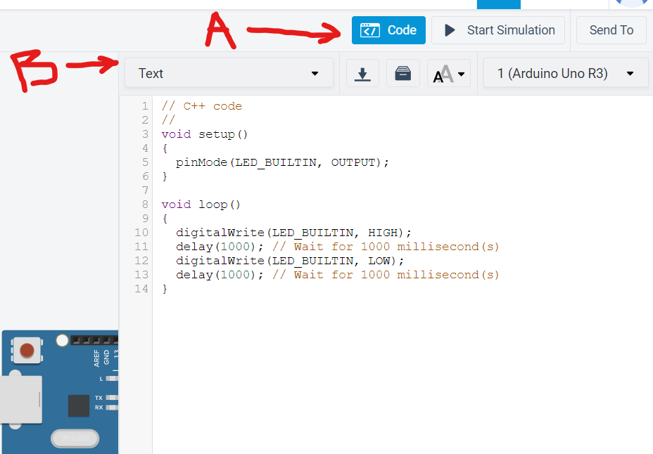
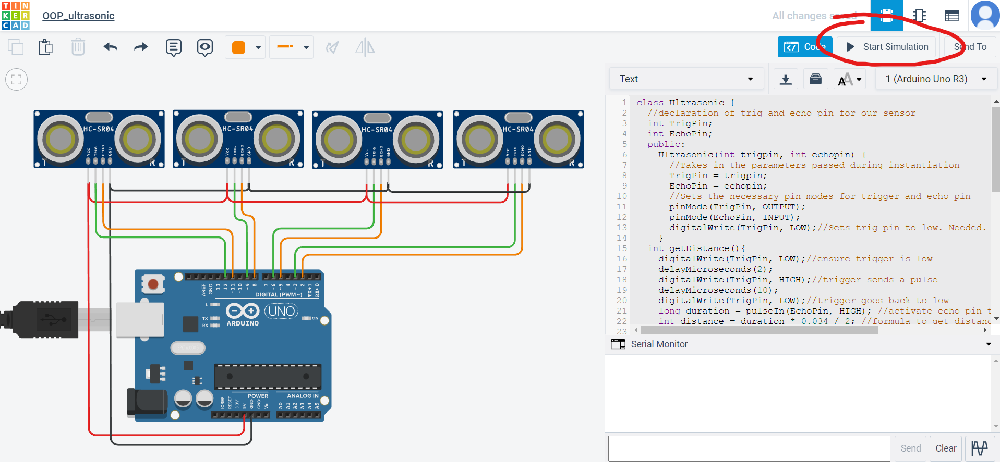
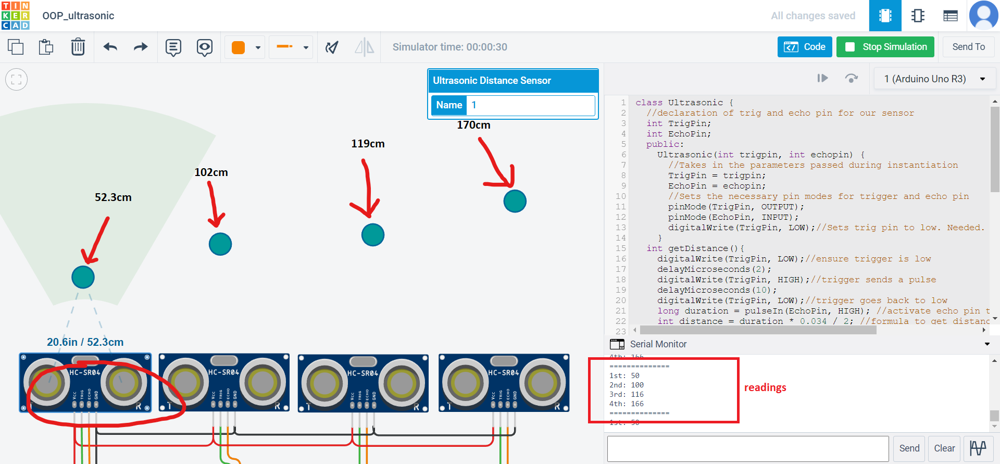

In this section, instead of using LEDs (click [here](https://github.com/jccatilo/arduino/tree/main/1_OOP_LED) if you haven't seen the pre-requisite OOP tutorial with LEDs) to demonstrate OOP, we will use a famous sensor called HC-SR04 ultrasonic sensor.

We will still utilize tinkercad so that we can still appreciate the sensors without spending a buck. 

Let's start.

1. Create a tinkercad project and put an Arduino uno and four ultrasonic sensors. We can apply this on RC car projects with collision detection, conveyor counting systems, etc. See image below for our common connection diagram.


2. To start coding, press **Code** (A) and switch to **text** mode (B).


3. Clear out everything. We need to first create a parent object for our ultrasonic sensors.
```
class Ultrasonic {
  //declaration of trig and echo pin for our sensor
  int TrigPin; 
  int EchoPin;
  public:
    Ultrasonic(int trigpin, int echopin) {
      //Takes in the parameters passed during instantiation
      TrigPin = trigpin;
      EchoPin = echopin;
      //Sets the necessary pin modes for trigger and echo pin
      pinMode(TrigPin, OUTPUT);
      pinMode(EchoPin, INPUT);
      digitalWrite(TrigPin, LOW);//Sets trig pin to low. Needed.
    }
};
```

4. create a class to get the distance in cm
```
class Ultrasonic {
  //declaration of trig and echo pin for our sensor
  int TrigPin; 
  int EchoPin;
  public:
    Ultrasonic(int trigpin, int echopin) {
      //Takes in the parameters passed during instantiation
      TrigPin = trigpin;
      EchoPin = echopin;
      //Sets the necessary pin modes for trigger and echo pin
      pinMode(TrigPin, OUTPUT);
      pinMode(EchoPin, INPUT);
      digitalWrite(TrigPin, LOW);//Sets trig pin to low. Needed.
    }

  int getDistance(){
    digitalWrite(TrigPin, LOW);//ensure trigger is low
    delayMicroseconds(2);
    digitalWrite(TrigPin, HIGH);//trigger sends a pulse
    delayMicroseconds(10);
    digitalWrite(TrigPin, LOW);//trigger goes back to low
    long duration = pulseIn(EchoPin, HIGH); //activate echo pin to wait for pulse coming back
    int distance = duration * 0.034 / 2; //formula to get distance in centimeters
    Serial.println(distance);
  }
};
```

5. Instantiate your objects.

```
// Ultrasonic <your_desired_object_name> (<trigger_pin>,<echo_pin>)
Ultrasonic us_4(3,2); 
Ultrasonic us_3(6,5);
Ultrasonic us_2(9,8);
Ultrasonic us_1(12,11);
```

6. Enable serial communication by putting **Serial.begin** in **setup()** and include some calling of **getDistance()** in your **loop()**.
```
void setup(){
Serial.begin(9600);
}

void loop(){
Serial.print("1st: ");
Serial.println(us_1.getDistance());
delay(500);
Serial.print("2nd: ");
Serial.println(us_2.getDistance());
delay(500);
Serial.print("3rd: ");
Serial.println(us_3.getDistance());
delay(500);
Serial.print("4th: ");
Serial.println(us_4.getDistance());
delay(500);
Serial.println("==============");
delay(500);
}
```
7. Final Code.

```
class Ultrasonic {
  //declaration of trig and echo pin for our sensor
  int TrigPin; 
  int EchoPin;
  public:
    Ultrasonic(int trigpin, int echopin) {
      //Takes in the parameters passed during instantiation
      TrigPin = trigpin;
      EchoPin = echopin;
      //Sets the necessary pin modes for trigger and echo pin
      pinMode(TrigPin, OUTPUT);
      pinMode(EchoPin, INPUT);
      digitalWrite(TrigPin, LOW);//Sets trig pin to low. Needed.
    }
  int getDistance(){
    digitalWrite(TrigPin, LOW);//ensure trigger is low
    delayMicroseconds(2);
    digitalWrite(TrigPin, HIGH);//trigger sends a pulse
    delayMicroseconds(10);
    digitalWrite(TrigPin, LOW);//trigger goes back to low
    long duration = pulseIn(EchoPin, HIGH); //activate echo pin to wait for pulse coming back
    int distance = duration * 0.034 / 2; //formula to get distance in centimeters
    return distance;
  }
};

//Instantiate your objects
// Ultrasonic <your_desired_object_name> (<trigger_pin>,<echo_pin>)
Ultrasonic us_1(12,11);
Ultrasonic us_2(9,8);
Ultrasonic us_3(6,5);
Ultrasonic us_4(3,2); 

void setup(){
Serial.begin(9600);
}

void loop(){
Serial.print("1st: ");
Serial.println(us_1.getDistance());
delay(500);
Serial.print("2nd: ");
Serial.println(us_2.getDistance());
delay(500);
Serial.print("3rd: ");
Serial.println(us_3.getDistance());
delay(500);
Serial.print("4th: ");
Serial.println(us_4.getDistance());
delay(500);
Serial.println("==============");
delay(500);
}
```
8. Press **Start Simulation**.


9. Move the circle objects to the indicated distance in the picture below. This is just setting a virtual object in front of the virtual HC-SR04 sensor. We can see the result in the serial monitor on the bottom right part of your browser.


10. We are done. Click this [link](https://www.tinkercad.com/things/idKq2mzaq5j-stunning-lahdi-amberis/) if you want to play with the project or if things doesn't go as you expect.

If there are optimizations you know, feel free to contact me. Or comment anywhere in this repo. 
Thank you!