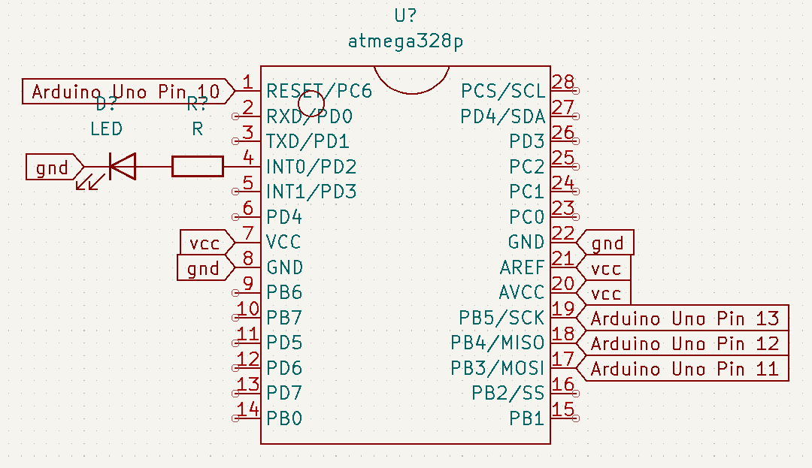

Reference:  [https://docs.arduino.cc/built-in-examples/arduino-isp/ArduinoToBreadboard](https://docs.arduino.cc/built-in-examples/arduino-isp/ArduinoToBreadboard)

Hardware needed (as worked for me):
1. Arduino Uno/Nano
2. ATMega328p DIP28 Chip on a breadboard (I just preferred putting soldering things that's why you will see a soldered assembly for demo.)
3. 1k resistor (just for testing uploaded code)
4. 1 LED (just for testing the uploaded code on the chip)
5. Male dupont cables or any wire of your preference. Use what you have man.

Files needed
1. [ArduinoISP_jc.ino](https://github.com/jccatilo/arduino/blob/main/3_ATMEGA328p_minimal_circuit/ArduinoISP_jc/ArduinoISP_jc.ino) (I have modified this from ArduinoISP.ino to suit our arduino uno programmer and connection diagram)
2. [breadboard-1-6-x.zip file](https://www.arduino.cc/en/uploads/Tutorial/breadboard-1-6-x.zip?_gl=1*104ebcy*_ga*MzQ5MjQ5MTU1LjE2NDc5OTk1MDc.*_ga_NEXN8H46L5*MTY1NzEyMDQ1NS4yNy4wLjE2NTcxMjA0NTUuNjA.) from arduino website.
3. Arduino IDE (any version)

Conection diagram

Creating a Programmer from an Arduino Uno
1. Upload ArduinoISP_jc.ino program to your arduino uno as you normally know.

Upload bootloader to ATMega328p
1. In your Arduino sketcbook, create a directory named **hardware**
2. Extract the contents of the **breadboard-1-6-x.zip file** to the hardwar directory you created
3. Make sure the file folders look like this **C:\Users\John Carlo\Documents\Arduino\hardware\breadboard\avr** with some more files.
4. Open Arduino IDE and make sure to put omething but not exactly like this **C:\Users\<YOUR PC USERNAME>\Documents\Arduino\hardware** in your *file/preferences/additional boards manager* in your IDE toolbar.
5. Restart Arduino IDE.
6. In your *tools/boards:XXXXX* you should see a **ATMega328 on breadboard**. Go and select it.
7. In your *tools/programmer:XXXXX* you should choose **Arduino as ISP**.
8. Go to *tools* and now press **Burn bootloader**
9. If the physical connections are correct and steps above are observed, you should see a **Done uploading bootloader** in the IDE's terminal prompt. 

Uploading a blinky program to your ATMega328p chip
1. Open Blinky program in your IDE.
2. Make sure to observe upload settings as stated in the **previous steps 6 and 7**.
3. **DO NOT PRESS UPLOAD**
4. In the toolbar, go to *Sketch* and press **Upload using Programmer**.
5. Everything should work fine. You can remove all other pin connections and just put the VCC and GND pins back.
6. You now have a programming circuit and an ATMega328p chip you can use on you personal project. Have fun!